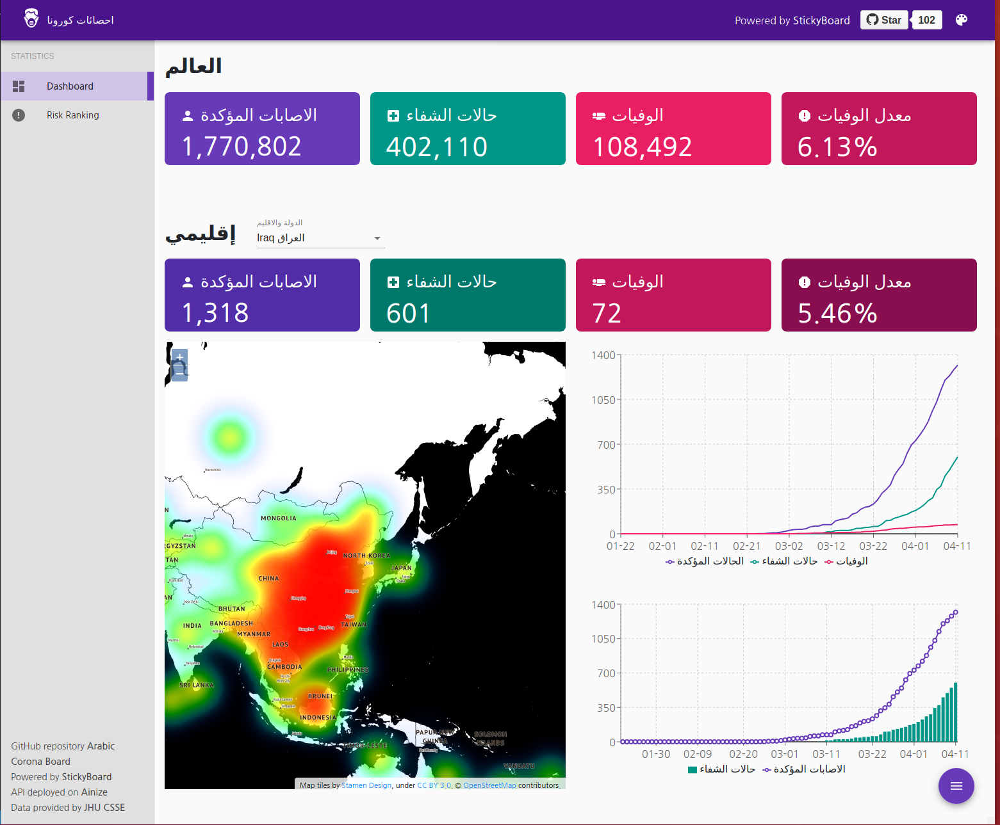

# Arabic CoronaBoard

<p align="left">
    <a target="_blank" rel="noopener noreferrer" href="https://corona.mtaqi.com/">
        
    </a>
</p>

Global dashboard in Arabic for monitoring Corona virus(COVID-19).

## Website
[](http://corona.mtaqi.com/)


## Build & Run
### Prerequisite
```bsh
$ npm install -g nodemon
$ npm install
```
### Development Mode

#### Run on terminal
```bsh
$ npm run watch
$ npm run dev
```

### Production Mode

#### Run on terminal
```bsh
$ npm run build
$ npm run production
```

#### Run as daemon using [PM2][pm2]
[pm2]: https://github.com/Unitech/pm2

```bsh
$ npm run build
$ npm start
```

### Dockerize

#### Build docker image
Enable [Docker Buildkit](https://docs.docker.com/develop/develop-images/build_enhancements/#to-enable-buildkit-builds) to speed up build
```bsh
$ DOCKER_BUILDKIT=1 docker build -t <dockerhub_username>/<dockerhub_repo_name>:latest .
```

#### Run
```bsh
$ docker run -p 3000:3000 <dockerhub_username>/<dockerhub_repo_name>:latest
```

#### Push docker image to DockerHub
```bsh
$ docker push <dockerhub_username>/<dockerhub_repo_name>:latest
```

## Attribution
- Forked from Soable corona-board project [Corona Board](https://github.com/soaple/corona-board/blob/master/README.md)
- Global Corona Dashboard powered by [StickyBoard](https://github.com/soaple/stickyboard/)
- API deployed and operated by [Ainize](https://ainize.ai/laeyoung/wuhan-coronavirus-api)
- Data provided by [JHU CSSE](https://github.com/CSSEGISandData/COVID-19)
